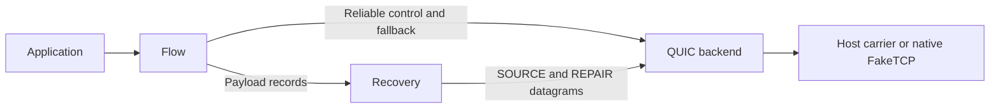

# QUICP architecture

This guide maps implementation responsibilities. The [protocol specification](protocol.md)
defines wire behavior; the [SDK contract](../sdk/README.md) defines foreign-language ownership.

## Follow one flow

1. `config` validates local policy. `transport` checks the supplied carrier addresses and MTU,
   builds the backend endpoint, and derives connection-wide recovery limits.
2. `flow` admits an OPEN and presents ordered reads and writes. Its reliable control stream
   carries admission, ACKs, credit, FIN, and reliable payload fallback.
3. `recovery` sends payloads as SOURCE datagrams, retains replay data, and dispatches received
   records to flows. It uses `fec` when repairs are needed. Both paths use `wire` for encoding
   and validation.
4. The QUIC backend handles packet ACKs, congestion control, pacing, TLS, and path validation.
   Host carriers or native FakeTCP adapters supply packet I/O.

## Find the owning module

| Concern | Owner | What callers need to know |
| --- | --- | --- |
| Local configuration | [`config.rs`](../src/config.rs) | Constructors validate values; external files and secrets need runtime checks. |
| Endpoint construction | [`transport.rs`](../src/transport.rs) | A `ConfiguredEndpoint` keeps the backend, its runtime, and its derived recovery capacity together. Host and Tokio adapters use the same endpoint constructors. |
| Ordered flow behavior | [`flow.rs`](../src/flow.rs) | Admission, byte offsets, credit, and terminal states belong to the flow. |
| Wire syntax | [`wire.rs`](../src/wire.rs) | Decode before acting. SOURCE views borrow validated input; control framing owns canonical lengths and frame limits. |
| Loss recovery and memory admission | [`recovery.rs`](../src/recovery.rs), [`fec.rs`](../src/fec.rs) | Reserve memory before retaining data or committing decoder changes. Parser storage is not a separate heap allocation. |
| Application replay admission | [`session.rs`](../src/session.rs) | A token, nonce, and bounded replay cache admit explicit early data. FakeTCP cookies serve a different purpose. |
| Host scheduling | [`host_runtime.rs`](../src/host_runtime.rs) | The host supplies the clock and advances bounded work after I/O or timer readiness. |
| Host datagrams | [`host_carrier.rs`](../src/host_carrier.rs) | Move complete datagrams through bounded queues; the host owns the underlay. |
| Packet buffer ownership | [`packet_ring.rs`](../src/packet_ring.rs) | A preallocated buffer moves between free storage, a lease, and the queued packets. Dropping a lease returns its buffer. |
| IP packet integration | [`platform.rs`](../src/platform.rs), [`smolstack.rs`](../src/smolstack.rs) | One device owns smoltcp state; read/write tokens borrow that device. |
| Native packet appearance and I/O | [`faketcp.rs`](../src/faketcp.rs), [`faketcp/`](../src/faketcp/) | Shared codec and per-path sequence state; explicit Linux, macOS, and Windows adapters. |
| Foreign-language engine | [`ffi.rs`](../src/ffi.rs), [`sdk/`](../sdk/) | One serialized engine owner. Submit an OPEN once, drive progress, and poll for its result. |

## Compile-time guarantees and runtime checks

Use types for ownership and validated construction; use constant evaluation for fixed layout
and format relationships. Do not recheck a private invariant on every call or claim that a type
can validate bytes that have not arrived yet.

| Guarantee | How it is enforced |
| --- | --- |
| A client always has a runtime | Its field is an `Arc`, not an optional value. Endpoint builders retain the runtime they used. |
| Pool mutation requires exclusive access | Private standard-library collections are inside a `Mutex`; mutation requires its guard's exclusive borrow. The queue contains no custom unsafe synchronization. |
| One lease owns each packet buffer | Leases are not cloneable. Their consuming methods and `Drop` implementations transfer or return the owned buffer. |
| A smoltcp token cannot outlive its device borrow | Token lifetimes enforce this relationship; the compile-fail example in `RingDevice` checks it. |
| Fixed C layouts match the declared contract | Rust const assertions run on every `ffi-c` build. [`ffi_header.c`](../tests/ffi_header.c) checks C and C++ layouts at compile time. |
| A canonical hostname fits its length field | Construction validates input once; the private field preserves that invariant. A const assertion proves the configured maximum fits `u8`. |
| Fixed system-structure and packet-header sizes fit their integer fields | Const evaluation rejects an invalid narrowing conversion during compilation. |

Packet count, MTU, output capacity, received frame lengths, capability bits, available memory,
handshake progress, and foreign pointers remain runtime concerns. Preserve their validation
before allocation, state mutation, or pointer access. C callers must still provide live pointers
and serialize engine calls; compile-time layout checks cannot prove those obligations.

Each packet ring has one short pool lock. Copies and caller callbacks run outside it. The pool
preallocates its buffers and queue storage; leases move those buffers without allocating new
payload storage. Producer/consumer contention is a measurement question, not a reason to retain
custom unsafe queues without evidence.

## Verify a change

Run the [local checks](../README.md#verify-locally). For ABI changes, also compile
`tests/ffi_header.c` as C11 and C++11, and run the SDK smoke tests against a newly built archive.
Compile-fail tests cover ownership misuse; runtime tests cover malformed input, backpressure,
cancellation, and panic recovery. Cross-compilation checks types and layouts, not driver access
or packet delivery on the target machine.

The [carrier matrix](adr/0001-carrier-platform-matrix.md) and
[datagram-first recovery decision](adr/0003-datagram-first-recovery.md) explain the enduring
design choices. Keep wire details in the protocol document and SDK call sequences in the SDK
guide rather than duplicating them here.
