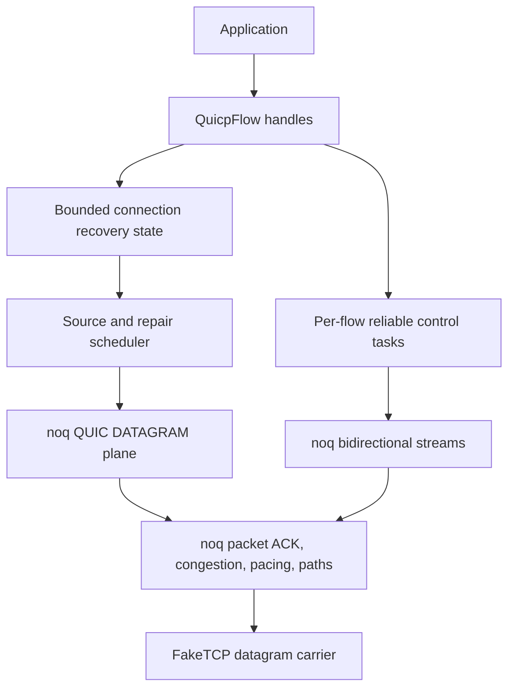
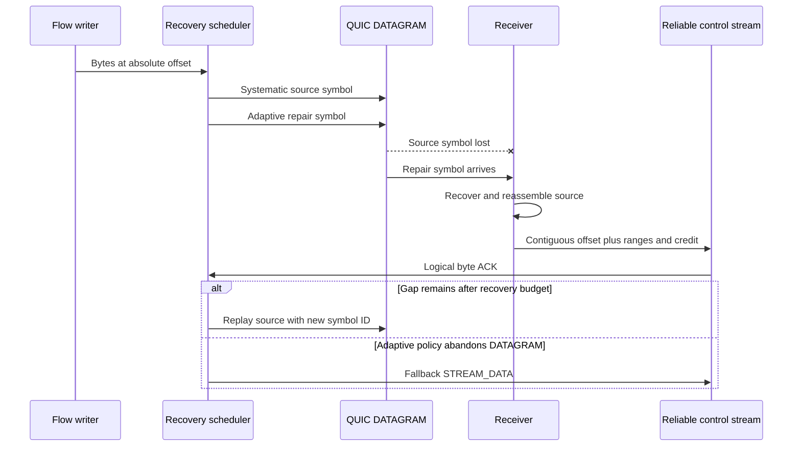
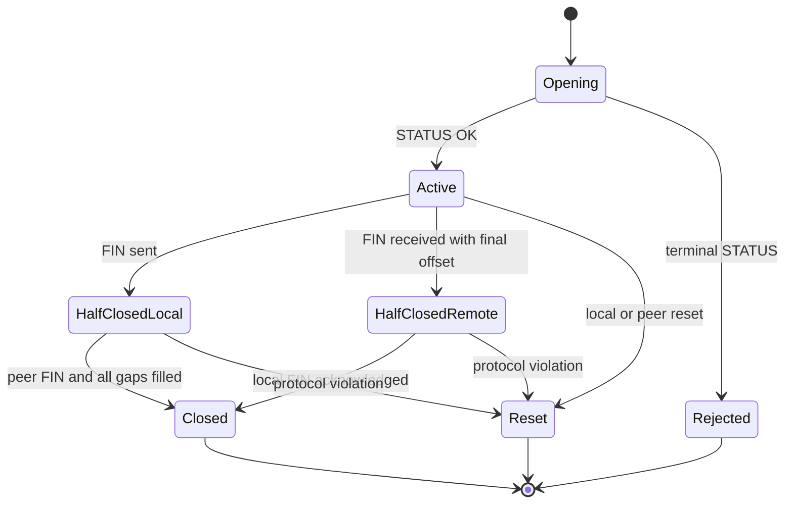
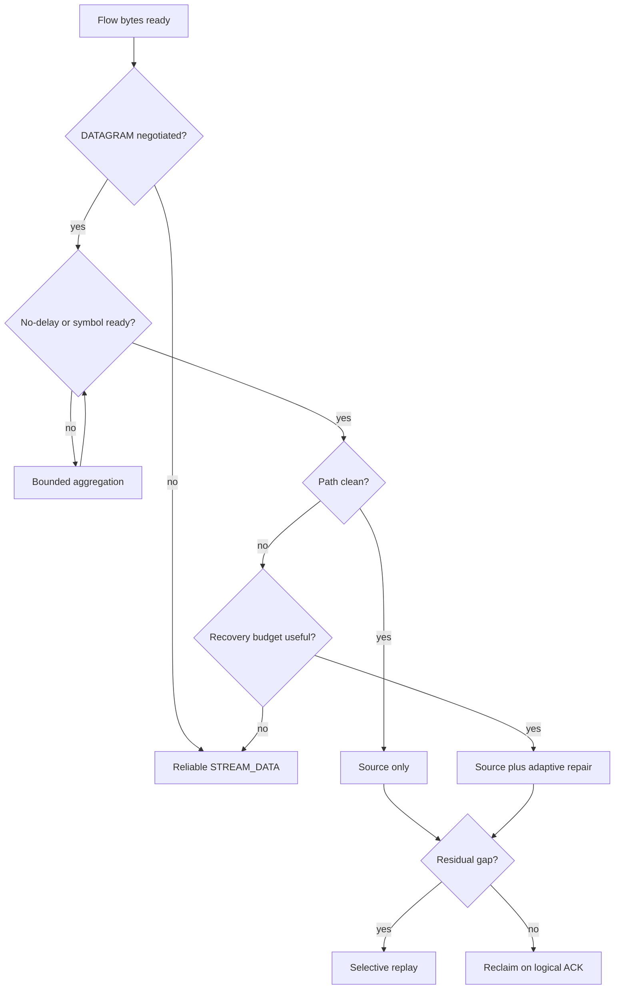

# QUICP/2 Datagram Recovery - Plan

## Goal Capsule

- **Objective:** Applications retain a TCP-like ordered flow API while QUICP recovers weak-path loss without waiting for reliable-stream retransmission on the primary data path.
- **Means:** Replace QUICP/1 flow payload streams with a connection-wide coded QUIC DATAGRAM plane, per-flow reliable control streams, logical byte acknowledgements, bounded replay, and adaptive fallback (KTD1-KTD8).
- **Authority:** `docs/adr/0003-datagram-first-recovery.md` governs architecture; Product Contract requirements govern behavior; Planning Contract decisions govern implementation.
- **Execution profile:** Breaking protocol change across the Rust core, optional Tokio adapter, C ABI, Swift/Kotlin SDKs, examples, tests, and benchmarks.
- **Stop conditions:** Stop if the implementation needs unbounded peer-controlled memory, weakens the explicit no-security boundary, exposes backend types publicly, or requires a `noq` per-path DATAGRAM patch before measurements justify it.
- **Tail ownership:** The final implementation unit owns cross-platform checks, protocol vectors, adversarial channels, fuzzing, documentation, and aligned performance evidence.

---

## Product Contract

### Summary

QUICP/2 makes adaptive DATAGRAM recovery the standard data path while keeping the established `Connection` and `QuicpFlow` experience TCP-like.
Each flow retains one reliable bidirectional QUIC stream for admission, control, and fallback data.
The connection shares bounded coding, replay, acknowledgement, scheduling, and path-measurement state across all flows.

### Problem Frame

QUICP/1 maps application bytes directly to reliable QUIC streams.
That isolates flows better than TCP but hides erasures from QUICP and makes each flow wait for backend retransmission.
The current Queqiao plugin changes only congestion configuration and cannot provide coded DATAGRAM recovery, logical byte acknowledgements, replay, or adaptive substrate selection.

### Key Decisions

- **Adaptive recovery is core protocol behavior.** (session-settled: user-approved — chosen over extending the existing congestion-only plugin: reliable streams cannot expose the erasures needed for coded recovery.) Governs R3-R7.
- **The public flow remains TCP-like.** (session-settled: user-directed — chosen over exposing DATAGRAM, ACK, and FEC callbacks: applications should replace TCP without owning transport recovery.) Governs R2, R4, R6.
- **QUICP/2 is a breaking single-profile protocol.** (session-settled: user-directed — chosen over dual QUICP/1 compatibility: compatibility would retain two data paths and multiply state-machine risk.) Governs R1.
- **Sliding-window coding spans the connection and all validated paths.** (session-settled: user-approved — chosen over per-flow or per-path blocks: shared symbols recover cross-flow and cross-path erasures without block-sealing delay.) Governs R5, R7.
- **Application 0-RTT is restricted to replay-safe operations.** (session-settled: user-approved — chosen over admitting ordinary early flow writes: transport acceptance cannot provide cross-connection exactly-once effects.) Governs R8.
- **The generic plugin registry is removed.** (session-settled: user-approved — chosen over hot-path plugin hooks: the repository has one recovery architecture and already has direct typed congestion and header-protection seams.) Governs R9.
- **TLS remains optional.** (session-settled: user-directed — chosen over making QUICP inherently encrypted: QUICP targets TCP-equivalent transport semantics and lets callers select security.) Governs R10.
- **Cargo features select build-time adapters only.** (session-settled: user-directed — chosen over recovery or policy features: runtime protocol behavior must not split the crate into incompatible builds.) Governs R9-R11.

### Requirements

**Wire and flow behavior**

- R1. QUICP/2 uses one exact profile token, negotiates DATAGRAM, FEC limits, and early-data application capabilities, and leaves multipath negotiation to QUIC transport parameters without retaining a QUICP/1 runtime mode.
- R2. `Connection::open_flow`, `Connection::accept_flow`, `PendingFlow`, and `QuicpFlow` preserve their TCP-like roles and poll-based read, write, flush, shutdown, reset, and no-delay behavior.
- R3. Each admitted flow uses one reliable bidirectional stream for framed control and fallback data while source records identify that stream ID and normally carry selected payload bytes over QUIC DATAGRAM.
- R4. QUICP owns absolute flow offsets, bounded selective byte acknowledgements, receive credit, replay, reassembly, FIN gaps, duplicates, and ordered delivery.
- R5. QUICP uses systematic GF(256) sliding-window random linear coding with pinned arithmetic, coefficient generation, padding, identifier rules, a maximum 256-source repair span, and at least a 512-symbol decoder window.
- R6. No-delay writes are emitted without an aggregation wait; delay-enabled writes may share a source symbol; clean paths emit no parity; residual loss completes through replay or reliable-stream fallback.

**Paths and early data**

- R7. One directional coding window spans all active paths while `noq` retains packet ACK, congestion, pacing, validation, and initial path scheduling ownership; FakeTCP sequence state remains independent per four-tuple.
- R8. Application 0-RTT requires an explicit replay-safe call, a valid expiring token from a dedicated server resumption secret, a fresh attempt nonce, compatible remembered capabilities, and bounded replay admission; no API claims cross-connection exactly-once delivery.

**Configuration, security, and portability**

- R9. Recovery and security policy use validated typed configuration; Rust custom congestion and header protection remain direct options; generic plugin registration and runtime-policy Cargo features do not exist.
- R10. TLS and no-security profiles support the same QUICP/2 flow contract; the no-security profile remains unauthenticated and unencrypted, and header protection remains separate from authenticity.
- R11. The core remains runtime-neutral, Tokio remains an optional adapter, and the C/Swift/Kotlin engine exposes synchronous drive, connection, flow, and underlay DATAGRAM operations with caller-owned boundary buffers and built-in bounded policy values.
- R12. Every peer-controlled length, count, offset, range, symbol identifier, coefficient set, token, and negotiated limit is validated before allocation or shared-state mutation; pressure applies backpressure or the documented flow/connection error scope.

**Proof and release**

- R13. Deterministic tests cover clean, random-loss, burst-loss, reorder, duplicate, repair-loss, DATAGRAM-before-OPEN, malformed input, limit exhaustion, flow races, multipath failover, and accepted or rejected early data.
- R14. Benchmarks compare reliable-only and adaptive QUICP on the same carrier, runtime, payloads, byte count, security profile, and path model, and report useful goodput, p50/p99 latency, parity, replay, CPU, allocations, and peak memory.

### Acceptance Examples

- AE1. **Clean path:** Given adaptive recovery and no observed loss, writes complete over source DATAGRAMs, parity stays zero, and reads expose the original ordered bytes.
- AE2. **Single erasure:** Given one missing source inside a decodable window, a repair DATAGRAM reconstructs it and the flow advances before its replay timer fires.
- AE3. **Residual loss:** Given more missing sources than the received repair rank can recover, the sender replays only acknowledged gaps and eventually exposes one ordered byte sequence without duplicates.
- AE4. **Cross-flow isolation:** Given a gap on flow A and complete data on flow B, flow B remains readable while flow A waits for recovery.
- AE5. **No-delay:** Given a small write with no-delay enabled, the scheduler emits it on the next bounded driver turn instead of waiting for another flow or buffer fill.
- AE6. **Multipath failover:** Given a validated backup and loss of the primary, repair or replay arriving on the backup completes the same logical flow without changing its flow identifier.
- AE7. **Early replay rejection:** Given the same token identity and attempt nonce twice, the server admits at most one replay-safe early attempt and performs no origin action for the rejected replay.
- AE8. **Malformed repair:** Given a repair frame whose encoding, span, or symbol identifier is invalid, the receiver drops and counts it before decoder mutation; a valid frame that proves negotiated shared-resource abuse closes the connection.

### Success Criteria

- The deterministic single-erasure scenario delivers recovered bytes before replay and the residual-loss scenario completes through selective replay.
- Clean-path adaptive mode emits no repair symbols and stays within 5% of reliable-only median goodput on the aligned Linux raw-carrier benchmark for 1200-byte and 4096-byte writes.
- All replay, decoder, reassembly, pre-open, ACK-range, and early-attempt stores remain at or below configured hard limits under adversarial tests.
- The public Rust API, C header, Swift package, Kotlin/JNI bridge, rustdoc, and supported CI targets build from the same protocol policy model.
- A C, Swift, or Kotlin host can establish a QUICP/2 connection, open or accept a flow, exchange bytes, and drive one or two host-owned paths without receiving a Rust future or callback.

### Scope Boundaries

**In scope**

- QUICP/2 wire grammar, recovery state, FEC, adaptive policy, multipath integration, application 0-RTT, typed configuration, SDK exposure, examples, tests, fuzzing, metrics, and aligned benchmarks.
- Deletion of QUICP/1-only flow code and the generic plugin registry after QUICP/2 end-to-end coverage exists.

**Deferred to Follow-Up Work**

- Explicit `send_datagram_on(path_id)` support in the vendored backend, unless U6 measurements prove backend scheduling blocks useful path diversity.
- A SIMD GF(256) kernel, huge pages, NUMA controls, or alternative FEC algorithms, unless profiles identify the scalar codec as a material release blocker.
- A distributed replay cache for multi-instance servers; the initial claim is process-local replay admission only.
- Transparent flow resumption across a lost QUICP connection and more than the current bounded primary/backup path policy.

**Outside this product's identity**

- DNS, FakeIP allocation, VPN policy, TUN creation, and mobile platform permissions remain adapter or application responsibilities.
- FakeTCP remains a datagram-preserving carrier and never gains reliable ordering, retransmission, logical ACK, or FEC ownership.
- TLS is not required for the baseline transport, and checksums or FEC never become an authenticity boundary.

---

## Planning Contract

### Key Technical Decisions

- KTD1. **Use one `quicp/2` profile token.** `src/session.rs` admits one token and validates separately negotiated capabilities, so multipath does not create a second application profile. (session-settled: user-directed — chosen over separate single-path and multipath tokens: capabilities vary independently and should not multiply protocol identities.) Governs R1, R7.
- KTD2. **Keep wire codecs checked and allocation-bounded in `src/wire.rs`.** Decode from byte slices, encode into caller-provided storage where practical, and pin results with committed vectors; do not add `bytemuck`, `zerocopy`, or `rkyv` unless a measured parser bottleneck justifies a dependency. Governs R1, R3-R5, R8, R12.
- KTD3. **Add only two private recovery modules.** `src/recovery.rs` owns ranges, replay, reassembly, flow credit, scheduling, and policy state; `src/fec.rs` owns GF(256) symbol algebra and decoder rows. Split either module only after its responsibilities no longer form one coherent invariant set. (session-settled: user-directed — chosen over a trait-heavy codec and scheduler hierarchy: only one wire algorithm and one recovery architecture are required.) Governs R4-R6, R9, R12.
- KTD4. **Drive recovery through the existing backend runtime seam.** Retain `Arc<dyn noq::Runtime>` for both client and server connections, spawn one bounded DATAGRAM task per connection and one control-stream task per admitted flow, and wake `QuicpFlow` handles through shared bounded state. Reuse one private path aggregator for raw and one-or-two-socket host carriers. No new runtime feature or public executor trait is added. Governs R2-R4, R7, R11.
- KTD5. **Use `noq` DATAGRAM and path telemetry without a vendor patch.** Configure bounded send/receive DATAGRAM buffers, use `send_datagram_wait` for backpressure, consume one `read_datagram` stream, and let `noq` schedule packets until U6 proves a need for explicit placement. (session-settled: user-approved — chosen over patching per-path DATAGRAM send immediately: the wire design does not require placement and the backend already owns path congestion.) Governs R3, R7, R12.
- KTD6. **Implement RFC 8681-style sliding RLC internally.** Pin the field polynomial, deterministic coefficient generator, zero padding, symbol IDs, wrap rules, and elimination order; use scalar table arithmetic first and benchmark before adding SIMD or a block-code dependency. (session-settled: user-approved — chosen over Reed-Solomon blocks or a public FEC trait: block sealing adds delay and current Rust crates do not implement the selected sliding wire model.) Governs R5, R6, R12-R14.
- KTD7. **Turn `QuicpFlow` into a handle, not a backend stream owner.** The handle keeps current poll semantics and accesses bounded per-flow state; its private control task owns the `noq` send/receive streams. `PendingFlow::accept` attaches the task only after policy admission. Governs R2-R4, R12.
- KTD8. **Use one adaptive policy with a reliable-only runtime mode.** `RecoveryConfig` selects adaptive or reliable-only behavior; adaptive decisions use directional loss, RTT, delivery, replay cost, and burst observations. This is configuration, not a Cargo feature or plugin callback. Governs R6, R7, R9, R14.
- KTD9. **Expose 0-RTT through one explicit replay-safe flow operation.** The client combines connection resumption, OPEN, and bounded initial bytes only when the caller selects `ReplaySafe`; absent or rejected resumption falls back once to ordinary OPEN without duplicate local delivery. Tokens use the existing `ring` dependency and a secret distinct from the FakeTCP cookie to bind the profile, capabilities, server epoch, expiry, token identity, and attempt nonce. Governs R8, R10-R12.
- KTD10. **Apply failures at the narrowest safe scope.** Invalid flow offsets, credit, ACK, or FIN transitions reset that flow with QUIC `RESET_STREAM`; invalid shared negotiation or peer resource abuse closes the connection; malformed source or repair DATAGRAMs that cannot enter shared state are dropped and counted. Governs R4, R8, R12-R13.
- KTD11. **Replace the packet-only FFI bridge with one synchronous QUICP engine.** The opaque engine owns `HostRuntime`, endpoint, connection and generation-checked flow slots; hosts drive bounded work and provide underlay DATAGRAM or flow buffers per call. The ABI increments `QUICP_ABI_VERSION`, removes the `ffi-c` dependency on smoltcp, and adds no callbacks, futures, retained foreign pointers, or Rust collections. Swift and Kotlin remain thin value translations. Governs R2, R7, R9-R12.
- KTD12. **Expose recovery observations as snapshots.** Rust and foreign callers read bounded counters and gauges for source, repair, recovered, replayed, fallback, dropped, path, buffer, and early-replay events; the hot path does not invoke metrics callbacks. Governs R11, R13-R14.

### High-Level Technical Design

The requirements and KTDs are normative; the diagrams map the same ownership and sequencing.

**Component and data ownership**

**Source, repair, ACK, and replay sequence**

**Flow lifecycle**

**Adaptive substrate decision**

### Sequencing

U1 fixes the wire contract before code depends on it.
U2 removes the obsolete extension seam and establishes validated recovery policy.
U3 proves the sans-I/O invariants before transport integration.
U4 and U5 then connect the engine to `noq` and preserve the public flow API.
U6 adds adaptive multipath behavior only after the single-path path is correct.
U7 adds the security-sensitive early-data path after ordinary delivery is stable.
U8 replaces the packet-only C bridge with the synchronous QUICP engine.
U9 keeps Apple and Android wrappers thin around that engine.
U10 owns documentation, adversarial proof, and the release gate.

### System-Wide Impact

- **Rust users:** Flow method roles remain familiar, but wire compatibility and plugin APIs break; configuration gains recovery policy and early-data limits.
- **Carrier adapters:** Packet ownership and FakeTCP format stay unchanged; payload timing and DATAGRAM volume change.
- **SDK users:** The ABI version changes from a packet-only bridge to a complete synchronous QUICP engine; foreign callers still own memory, threading, socket I/O, and drive timing.
- **Operations:** Deployments gain parity, replay, recovery-latency, path, and early-replay metrics; process-local early replay state must be sized and monitored.
- **Security:** TLS remains optional, but all early tokens and untrusted recovery frames gain explicit validation and bounded state.

### Risks and Dependencies

- **Backend runtime ownership:** Recovery stalls if a connection loses its runtime handle. Mitigation: make runtime retention a connection-construction invariant and test host-driven plus Tokio execution.
- **Feedback loops:** QUIC packet recovery and QUICP byte replay can overreact to the same loss. Mitigation: logical ACK owns byte reclamation, replay uses a bounded timer and gap evidence, and the adaptive policy stops parity on clean paths.
- **Decoder CPU abuse:** Valid-looking high-rank repair frames can consume CPU. Mitigation: cap span, rows, operations per driver turn, and peer repair rate before elimination.
- **Pre-open reordering:** DATAGRAM can arrive before its reliable OPEN. Mitigation: use a small connection-wide pre-open budget and expire or reject excess state without creating flows.
- **0-RTT replay:** A process restart or multi-instance deployment can lose local replay history. Mitigation: document process-local scope and never permit non-replay-safe operations.
- **No-security bearer replay:** A passive observer can copy a valid no-security resumption token and present a fresh nonce. Mitigation: describe the token as server-issued admission data rather than client identity, use the cache only for exact attempts, and keep every admitted operation replay-safe.
- **Vendored backend drift:** `noq` is pinned and patched locally. Mitigation: keep QUICP/2 framing outside vendor code and add a vendor patch only through an isolated, measured change.
- **Performance regression:** Shared state can introduce contention and copies. Mitigation: start with one bounded owner per connection, reuse `Bytes`, benchmark allocations and CPU, and optimize only measured hotspots.
- **Foreign handle misuse:** Stale or cross-engine flow IDs can target recycled state. Mitigation: use generation-checked slots, validate every handle before mutation, and serialize one engine owner.

### Sources and Research

- `docs/adr/0003-datagram-first-recovery.md` owns the accepted architecture and rejected alternatives.
- `docs/protocol.md` is the QUICP/1 contract that U1 replaces atomically with code and vectors.
- `docs/research/protocol-foundations.md` records QUIC stream, admission, 0-RTT, and resource-boundary research.
- `docs/research/multipath-quic.md` records the pinned `noq` multipath surface and validation rules.
- [RFC 8681](https://www.rfc-editor.org/rfc/rfc8681.html) supplies the sliding-window RLC algorithmic baseline.
- [RFC 9221](https://www.rfc-editor.org/rfc/rfc9221.html) defines the QUIC DATAGRAM transport extension implemented by the vendored backend.

---

## Implementation Units

| Unit | Outcome | Primary files | Depends on |
| --- | --- | --- | --- |
| U1 | Frozen QUICP/2 target contract | `docs/protocol-v2.md`, `tests/vectors/quicp2.txt` | None |
| U2 | Typed recovery configuration | `src/config.rs`, `src/plugin.rs`, `src/queqiao.rs` | U1 |
| U3 | Sans-I/O recovery and FEC | `src/recovery.rs`, `src/fec.rs`, `src/wire.rs` | U1, U2 |
| U4 | Runtime-neutral DATAGRAM driver | `src/transport.rs`, `src/host_carrier.rs` | U1-U3 |
| U5 | TCP-like flow handles | `src/flow.rs`, `src/session.rs` | U4 |
| U6 | Adaptive multipath policy | `src/recovery.rs`, `src/multipath.rs` | U5 |
| U7 | Replay-safe application 0-RTT | `src/no_security.rs`, `src/transport.rs` | U5, U6 |
| U8 | Synchronous C engine | `src/ffi.rs`, `include/quicp.h` | U1-U7 |
| U9 | Thin Apple and Android SDKs | `sdk/apple`, `sdk/android` | U8 |
| U10 | Release proof and documentation | `docs/protocol.md`, `fuzz`, `benches/loopback.rs` | U1-U9 |

### U1. Freeze the QUICP/2 wire contract

- **Goal:** Freeze complete QUICP/2 framing, negotiation, limits, and state transitions without making the still-QUICP/1 runtime claim conformance early.
- **Requirements:** R1, R3-R6, R8, R12-R13.
- **Dependencies:** None.
- **Files:** Add `docs/protocol-v2.md` and `tests/vectors/quicp2.txt`; modify `docs/README.md` to label the target specification as not yet implemented.
- **Approach:**
  1. Define the single profile token and capability negotiation without a multipath-specific token.
  2. Define length-delimited control frames for OPEN, STATUS, ACK ranges, MAX_OFFSET, FIN, and STREAM_DATA; use QUIC `RESET_STREAM` for abortive termination.
  3. Define source and repair DATAGRAM fields, integer encoding, identifier wrap rules, coefficient seed, padding, and every negotiated or absolute limit per KTD2 and KTD6.
  4. Specify decoder rejection for non-canonical, overflowing, truncated, excessive, or trailing input before session-state mutation.
  5. Commit language-neutral hex vectors for every frame plus invalid boundary cases.
- **Patterns to follow:** Existing normative field tables and state rules in `docs/protocol.md`.
- **Test scenarios:** Test expectation: none -- this unit freezes the target contract and vectors; U3 implements and executes every positive and negative vector.
- **Verification:** The target specification and exact vectors agree on every wire value and bound, while `docs/protocol.md` remains the truthful current QUICP/1 contract until U10.

### U2. Replace plugins with typed recovery configuration

- **Goal:** Delete the shallow registry and expose only the runtime choices QUICP/2 needs.
- **Requirements:** R6, R9-R12.
- **Dependencies:** U1.
- **Files:** Modify `src/config.rs`, `src/congestion.rs`, `src/lib.rs`, `src/transport.rs`, `tests/config.rs`, `tests/public_api.rs`, `README.md`, and `Cargo.toml`; delete `src/plugin.rs`, `src/queqiao.rs`, `docs/plugin-system.md`, and `examples/queqiao_plugin.rs`; modify `examples/README.md` and `benches/loopback.rs`.
- **Approach:**
  1. Add bounded adaptive and reliable-only recovery configuration to `QuicpTransportConfig` per KTD8.
  2. Keep `TransportOptions` as the direct Rust-only custom congestion and header-protection seam.
  3. Remove registry capacity, duplicate-name, application-order, and Queqiao plugin behavior instead of recreating them under new names.
  4. Keep recovery selection as runtime data under existing builds; add no feature flag and no one-implementation trait.
  5. Validate cross-field limits once during endpoint construction and pass a validated snapshot into recovery state.
- **Patterns to follow:** Existing `QuicpTransportConfig` defaults, `with_*` builders, `serde(deny_unknown_fields)`, and `ValidatedClientConfig` or `ValidatedServerConfig` construction.
- **Test scenarios:**
  - Parse defaults and explicit adaptive or reliable-only TOML and reject unknown modes and zero or over-limit budgets.
  - Reject inconsistent replay, decoder, source span, pre-open, and ACK-range limits before endpoint construction.
  - Build transport options with built-in and custom congestion plus custom header protection without any registry.
  - Compile the public API test without `PluginRegistry`, `QuicpPlugin`, `QueqiaoPlugin`, or recovery Cargo features.
- **Verification:** The removed symbols and files have no references, configuration fails closed, and all supported feature combinations still select the same QUICP/2 runtime policy model.

### U3. Build the bounded sans-I/O recovery core

- **Goal:** Prove logical reliability and sliding-window FEC independently of sockets, runtimes, and `noq`.
- **Requirements:** R4-R6, R12-R13.
- **Dependencies:** U1, U2.
- **Files:** Add `src/recovery.rs`, `src/fec.rs`, and `tests/recovery.rs`; modify `src/lib.rs`, `src/session.rs`, `src/wire.rs`, and `tests/wire.rs`.
- **Approach:**
  1. Implement the U1 control, source, repair, capability, and profile codecs in `src/wire.rs` and `src/session.rs` per KTD1 and KTD2.
  2. Implement bounded acknowledged-range normalization, replay retention, receive reassembly, credit checks, FIN handling, duplicate suppression, and source-record packing in `src/recovery.rs` per KTD3.
  3. Implement deterministic scalar GF(256) arithmetic, systematic encoding, seeded coefficients, and bounded incremental elimination in `src/fec.rs` per KTD6.
  4. Reuse `Bytes` for retained payload ownership and vectors preallocated from validated connection limits; do not allocate from frame-declared counts.
  5. Make each driver step cap symbols, elimination work, ACK ranges, and flow wakeups so one connection cannot monopolize an executor.
- **Execution note:** Implement conformance vectors and deterministic erasure-channel tests before transport integration.
- **Patterns to follow:** Existing bounded packet ownership in `src/packet_ring.rs` and checked codec errors in `src/wire.rs`.
- **Test scenarios:**
  - Encode and decode each QUICP/2 control, source, and repair frame and compare exact bytes with `tests/vectors/quicp2.txt`.
  - Reject QUICP/1 tokens, multipath token variants, unknown capability bits, non-canonical integers, wrapped ranges, excessive ACK ranges, trailing bytes, empty frames, truncation, and declared-length overflow.
  - Decode the maximum legal 256-source repair span and reject 257 before allocating coefficient or row storage.
  - Recover one and multiple missing source symbols and match the exact pinned GF(256) vectors.
  - Feed clean, random-loss, burst-loss, reorder, duplicate, repair-loss, and wrap-boundary symbol sequences with a fixed seed and reconstruct the same logical bytes.
  - Leave an underdetermined matrix unrecovered, emit residual gaps, replay only those byte ranges, and reclaim storage only after logical ACK.
  - Keep flow B readable while flow A has a gap, and expose EOF only after all bytes below the final offset are contiguous.
  - Reject offset overflow, overlapping contradictory bytes, invalid credit, excessive ACK ranges, decoder-row exhaustion, and operation-budget exhaustion without exceeding configured memory.
- **Verification:** Sans-I/O tests prove exact wire arithmetic, bounded work, ordered delivery, selective replay, and flow isolation with no backend connection.

### U4. Add the connection-wide DATAGRAM driver

- **Goal:** Connect the recovery core to QUIC DATAGRAM while preserving runtime-neutral execution and backend packet ownership.
- **Requirements:** R1, R3-R5, R11-R13.
- **Dependencies:** U1-U3.
- **Files:** Modify `src/transport.rs`, `src/transport/tokio.rs`, `src/multipath.rs`, `src/host_carrier.rs`, `src/host_runtime.rs`, `src/config.rs`, `tests/host_carrier.rs`, and `tests/host_runtime.rs`; add `tests/datagram_connection.rs`.
- **Approach:**
  1. Retain the existing `Arc<dyn noq::Runtime>` through client, server, incoming, and established connection construction per KTD4.
  2. Move the existing private path aggregation out of the Tokio-only module and reuse it for one or two validated `HostDatagramSocket` paths without changing each socket's SPSC ownership.
  3. Enable bounded backend DATAGRAM send and receive buffers from validated recovery limits.
  4. Start exactly one connection DATAGRAM task that reads, validates, demultiplexes, schedules source or repair output, and applies bounded work per wake.
  5. Use `send_datagram_wait` for backpressure and one `read_datagram` owner; map unsupported peer capability to reliable-only fallback.
  6. Close the connection if the driver cannot be started, panics, or violates shared resource invariants.
- **Patterns to follow:** `spawn_path_event_monitor`, `HostRuntime::spawn`, connection permits, and existing host-driven bounded progress.
- **Test scenarios:**
  - Establish host-driven and Tokio connections, negotiate DATAGRAM, and exchange source symbols through one reader and writer owner.
  - Establish a host-driven connection over two independently drained sockets and preserve source and destination addresses for each path.
  - Fall back to reliable-only mode when the peer does not negotiate DATAGRAM and reject adaptive-required policy without silent downgrade.
  - Deliver DATAGRAM before OPEN into a bounded pre-open stash, attach it after OPEN, and reject expiry or budget overflow.
  - Saturate backend DATAGRAM buffers and observe pending backpressure without dropping accepted reliable flow bytes.
  - Shut down a connection with pending driver work and release tasks, permits, buffers, and wakers without a hang.
- **Verification:** The same connection driver advances under `HostRuntime` and Tokio, owns a single DATAGRAM reader, and respects every configured buffer and work bound.

### U5. Preserve the TCP-like flow API over recovery handles

- **Goal:** Route application reads and writes through logical recovery while keeping public flow behavior coherent.
- **Requirements:** R2-R6, R9, R12-R13.
- **Dependencies:** U4.
- **Files:** Modify `src/flow.rs`, `src/flow/tokio.rs`, `src/transport.rs`, `src/session.rs`, `tests/flow.rs`, and `tests/public_api.rs`; add `tests/flow_e2e.rs`.
- **Approach:**
  1. Replace direct backend stream fields in `QuicpFlow` with a private connection and flow handle per KTD7.
  2. Keep OPEN and STATUS admission on the reliable stream, then transfer stream ownership to one control task that frames ACK, credit, FIN, and fallback data while QUIC `RESET_STREAM` carries abortive termination.
  3. Make `poll_write` accept only bytes retained by the bounded replay buffer; return pending under local pressure instead of discarding accepted data.
  4. Make `poll_read` expose only the contiguous receive prefix and wake on direct DATAGRAM, FEC recovery, replay, fallback data, FIN, or reset.
  5. Preserve no-delay, flush, half-close, reset, and Tokio `AsyncRead` or `AsyncWrite` adapter semantics.
- **Patterns to follow:** Current `QuicpFlow` poll methods, `ClientOpenGate`, `PendingFlow` admission, and `relay_bidirectional`.
- **Test scenarios:**
  - Cover AE1-AE5 with poll-based and Tokio adapter reads and writes.
  - Buffer delay-enabled small writes until flush or a symbol fills, and emit no-delay writes on the next bounded driver turn.
  - Return pending when replay credit is exhausted, then resume the same write after logical ACK releases storage.
  - Handle duplicate ACK, ACK beyond sent offset, credit regression, reset during pending write, crossed FIN, and FIN with a receive gap at the documented scope.
  - Reject payload before STATUS OK and prevent a rejected `PendingFlow` from installing recovery state.
- **Verification:** Existing TCP-like call sites compile with the intended breaking configuration changes, and end-to-end flow tests pass through DATAGRAM, FEC, replay, and reliable fallback.

### U6. Add adaptive recovery and multipath evidence

- **Goal:** Vary parity, replay, and fallback from directional path evidence without taking packet scheduling away from `noq`.
- **Requirements:** R5-R7, R12-R14.
- **Dependencies:** U5.
- **Files:** Modify `src/recovery.rs`, `src/multipath.rs`, `src/transport.rs`, `tests/recovery.rs`, `tests/raw_faketcp_multipath.rs`, `examples/multipath.rs`, and `benches/loopback.rs`.
- **Approach:**
  1. Feed bounded directional RTT, loss, delivery, burst, and replay observations from existing backend and path events into the one recovery policy.
  2. Emit no parity on a clean path, increase repair within configured limits after useful erasure evidence, add tail repair at burst boundaries, and abandon DATAGRAM after repeated residual failure.
  3. Keep one coding window across validated paths and retain independent FakeTCP tuple sequence state per R7.
  4. Publish lock-free counter and gauge snapshots per KTD12 without adding hot-path callbacks.
  5. Measure backend scheduling before considering the deferred per-path DATAGRAM API; do not patch vendor code in this unit.
- **Patterns to follow:** `PathManager` fail-closed transitions, backend congestion metrics, and the aligned raw-carrier benchmark harness.
- **Test scenarios:**
  - Cover AE6 with primary loss, validated backup delivery, and unchanged flow and symbol identities.
  - Keep repair count zero on a clean path and within configured rate and span caps under random and burst loss.
  - Recover a source sent before primary failure with repair or replay received after backup activation.
  - Mark lagged or contradictory path events unreliable and fall back or close according to the existing path policy.
  - Run reliable-only and adaptive benchmark modes through the same carrier, runtime, security, payload, and byte-count setup.
- **Verification:** Deterministic path tests prove cross-path recovery, clean-path parity suppression, bounded adaptation, and no dependency on a per-path vendor send extension.

### U7. Admit replay-safe application 0-RTT

- **Goal:** Send bounded replay-safe OPEN plus initial flow bytes before handshake completion without allowing ordinary early side effects.
- **Requirements:** R1, R2, R8, R10-R13.
- **Dependencies:** U5, U6.
- **Files:** Modify `src/config.rs`, `src/no_security.rs`, `src/session.rs`, `src/transport.rs`, `src/flow.rs`, `src/wire.rs`, `tests/config.rs`, `tests/flow_e2e.rs`, and `examples/zero_rtt.rs`; add `tests/zero_rtt.rs`.
- **Approach:**
  1. Add one explicit replay-safe client operation with bounded initial bytes; ordinary `connect` and `open_flow` remain replay-unsafe and wait for admission.
  2. Issue and validate MAC-protected resumption tokens with the existing `ring` dependency per KTD9.
  3. Store remembered profile and capability limits with the client resumption state and reject incompatible early attempts before origin admission.
  4. Add a bounded server attempt cache keyed by token identity and nonce, with expiry and process-local semantics.
  5. Support TLS resumption and no-security early keys without describing no-security as authenticated; fallback once after rejection and suppress duplicate local delivery.
- **Execution note:** Start with rejection, replay, expiry, and capability-mismatch tests before the accepted early path.
- **Patterns to follow:** Existing secure secret-file loading, `ring` use, `ClientOpenGate`, and backend `into_0rtt` acceptance semantics.
- **Test scenarios:**
  - Accept one valid replay-safe early flow and deliver its initial bytes once.
  - Reject an ordinary early operation before DNS, origin dialing, status, or payload delivery.
  - Cover AE7 with duplicate nonce, expired token, bad MAC, wrong profile, reduced limits, server epoch rotation, and replay-cache exhaustion.
  - Reject backend 0-RTT, retry the OPEN once after 1-RTT establishment, and expose one local byte sequence.
  - Restart the process-local replay cache and verify documentation and metrics do not claim distributed or cross-restart exactly-once protection.
- **Verification:** Accepted and rejected early paths pass under TLS and no-security profiles, and every rejected case is fail-closed before application side effects.

### U8. Replace the packet bridge with a synchronous C engine

- **Goal:** Let a foreign host drive real QUICP/2 connections and flows without Rust async types, callbacks, or retained foreign memory.
- **Requirements:** R2, R7, R9-R13.
- **Dependencies:** U1-U7.
- **Files:** Modify `Cargo.toml`, `src/ffi.rs`, `src/lib.rs`, `include/quicp.h`, `.github/workflows/ci.yml`, and `tests/public_api.rs`; add `tests/ffi.rs`.
- **Approach:**
  1. Remove the packet-only `PlatformPacketBridge` handle from the C ABI and make `ffi-c` independent of `platform-smoltcp` per KTD11.
  2. Add one opaque engine that owns validated config, `HostRuntime`, endpoint, connection state, and generation-checked flow slots.
  3. Expose synchronous bounded drive, timer query, one-or-two-path ingress and egress, connect or accept progress, flow open or accept progress, read, write, flush, shutdown, reset, and metrics snapshot operations.
  4. Return stable status values including `WOULD_BLOCK`, validate all handles and ranges before mutation, and never retain a foreign pointer after a call.
  5. Reuse caller-provided buffers at the ABI boundary; internal replay and protocol state remain Rust-owned and bounded by creation config.
- **Patterns to follow:** Current pointer/range validation, panic containment, batch progress, `HostRuntime::drive`, and caller-buffer ownership rules.
- **Test scenarios:**
  - Create client and server engines, pump underlay DATAGRAMs through caller buffers, establish a connection, open a flow, and echo bytes using only synchronous calls.
  - Drive two host paths, fail the primary, and complete an existing flow through the backup.
  - Reject unknown enum values, over-limit budgets, null or unaligned pointers, overlapping ranges, stale flow generations, cross-engine handles, decreasing time, concurrent drive, and ABI mismatch before state mutation.
  - Fill replay or egress capacity, return `WOULD_BLOCK`, and resume with the same logical bytes after progress.
  - Close an engine with active connections and flows, clear the foreign handle, and make repeated close deterministic.
- **Verification:** The C header smoke and Rust FFI tests perform a real QUICP/2 echo and multipath failover with no Rust future, callback, or retained foreign allocation crossing the boundary.

### U9. Keep Apple and Android SDKs thin

- **Goal:** Expose the synchronous engine idiomatically to Swift and Kotlin while keeping platform I/O and scheduling host-owned.
- **Requirements:** R2, R7, R9-R13.
- **Dependencies:** U8.
- **Files:** Modify `sdk/apple/Sources/Quicp/QuicpBridge.swift`, `sdk/apple/Tests/QuicpTests/QuicpTests.swift`, `sdk/apple/Examples/QuicpNetworkExtensionPacketTunnelProvider.swift`, `sdk/android/src/main/cpp/quicp_jni.c`, `sdk/android/src/main/kotlin/io/quicp/QuicpBridge.kt`, `sdk/android/src/test/kotlin/io/quicp/QuicpBridgeSmoke.kt`, `sdk/android/examples/io/quicp/QuicpVpnServiceExample.kt`, `sdk/README.md`, and `.github/workflows/ci.yml`.
- **Approach:**
  1. Translate C configuration, status, engine, flow, timer, path, and metrics values without recreating protocol policy in Swift, JNI, or Kotlin.
  2. Keep one serialized owner per engine and integrate `WOULD_BLOCK` plus timer deadlines into the host event loop.
  3. Keep Network Extension and `VpnService` examples as adapters that own permissions, TUN, smoltcp, underlay sockets, arenas, and scheduling.
  4. Use direct or caller-owned buffers for every packet and flow operation and release native handles deterministically.
- **Patterns to follow:** Existing Swift owner wrapper, Kotlin direct-buffer checks, JNI range conversion, and platform packet-loop examples.
- **Test scenarios:**
  - Establish and echo one QUICP/2 flow through the Swift and Kotlin wrapper smoke harnesses.
  - Translate adaptive, reliable-only, multipath, TLS or no-security, and replay-safe values and reject an unknown native value.
  - Surface `WOULD_BLOCK`, buffer-too-small, stale flow, closed engine, and ABI mismatch without leaking a native handle.
  - Verify direct buffers retain their positions and capacities and no wrapper stores a borrowed pointer beyond one call.
- **Verification:** Apple and Android CI builds and wrapper tests exercise the complete engine contract, while platform examples keep VPN and socket ownership outside the Rust core.

### U10. Complete documentation, fuzzing, benchmarks, and release gates

- **Goal:** Promote the implemented QUICP/2 contract and make it adversarially tested, discoverable, and measurable.
- **Requirements:** R1-R14.
- **Dependencies:** U1-U9.
- **Files:** Replace `docs/protocol.md` with the implemented `docs/protocol-v2.md` content and delete the temporary file; modify `src/lib.rs`, `README.md`, `docs/README.md`, `docs/production-acceptance-checklist.md`, `examples/README.md`, `examples/echo.rs`, `examples/socks5_tunnel.rs`, `examples/multipath.rs`, `examples/zero_rtt.rs`, `benches/README.md`, `benches/loopback.rs`, and `.github/workflows/ci.yml`; add `fuzz/Cargo.toml` and `fuzz/fuzz_targets/protocol.rs`.
- **Approach:**
  1. Promote the U1 target specification only after the runtime and vectors conform, then remove all QUICP/1 and plugin claims.
  2. Update rustdoc, README, SDK navigation, production checklist, and runnable examples to lead with QUICP/2 and link the normative specification.
  3. Add one fuzz target whose first input tag dispatches all untrusted control, source, repair, token, range, and recovery-state decoders; keep the fuzz dependency outside the published library graph.
  4. Extend the existing loopback harness with aligned reliable-only and adaptive modes and emit the complete R14 metric set from KTD12 snapshots and process measurements.
  5. Delete remaining QUICP/1-only implementation, tests, vectors, dead plugin content, stale benchmark modes, and unneeded dependencies after all replacement evidence passes.
- **Patterns to follow:** Current rustdoc example index, production checklist, CI target matrix, and Linux raw-carrier benchmark setup.
- **Test scenarios:**
  - Run the echo, SOCKS5 client/server, multipath, and 0-RTT examples against QUICP/2 and verify obsolete plugin and QUICP/1 references are absent.
  - Fuzz every parser and state-operation tag with arbitrary bytes without panic, out-of-bound allocation, or state mutation after rejection.
  - Run Windows host-driven tests, Apple target and Swift tests, Android target and JNI builds, Tokio tests, and runtime-neutral host tests.
  - Compare reliable-only and adaptive results for 64-byte, 1200-byte, and 4096-byte writes on clean and deterministic lossy paths and enforce the clean-path success criterion.
  - Build rustdoc and verify every README and examples index command or link points to an existing QUICP/2 surface.
- **Verification:** All CI, SDK, documentation, fuzz-smoke, examples, protocol vectors, aligned benchmarks, and production acceptance checks pass with no QUICP/1 or plugin compatibility surface left.

---

## Verification Contract

| Gate | Command or evidence | Done signal |
| --- | --- | --- |
| Formatting | `cargo fmt --all -- --check` | No formatting diff. |
| Minimal build | `cargo clippy --no-default-features --all-targets --locked -- -D warnings` | Runtime-neutral core and examples compile without warnings. |
| Full build | `cargo clippy --all-features --all-targets --locked -- -D warnings` | Optional adapters compile without warnings. |
| Core tests | `cargo test --no-default-features --locked` | Wire, recovery, host, flow, and security tests pass. |
| Full tests | `cargo test --all-features --locked` | Tokio, TLS, smoltcp, FFI, and platform tests pass. |
| Feature powerset | `cargo hack check --feature-powerset --depth 2 --all-targets --locked` | Build-time adapter combinations remain valid and no runtime-policy feature appears. |
| Rustdoc | `RUSTDOCFLAGS="-D warnings" cargo doc --features runtime-tokio,tls-rustls,platform-smoltcp,ffi-c --no-deps --locked` | docs.rs feature set builds with valid links and no stale plugin or QUICP/1 API. |
| Dependencies | `cargo audit` and `cargo deny check` | No unaccepted advisory, source, or license issue. |
| Fuzz smoke | `cargo fuzz run protocol -- -max_total_time=60` | Parser and state dispatch complete without crash or resource-bound violation. |
| Apple | Existing Apple CI target checks, `sdk/apple/build-xcframework.sh`, and `swift test --package-path sdk/apple` | iOS, simulator, macOS, C ABI, and Swift wrapper pass. |
| Android | Existing `cargo ndk` target checks plus JNI CMake build | API 21 arm64 and x86_64 Rust/JNI paths pass. |
| Windows | Existing Windows no-default and all-feature test jobs | Host-driven QUICP/2 API passes; native carrier remains subject to its existing platform gate. |
| E2E loss matrix | Deterministic clean, random-loss, burst-loss, reorder, duplicate, repair-loss, and failover scenarios | AE1-AE8 pass with bounded memory and the documented error scope. |
| Performance | Linux raw-carrier `benches/loopback.rs` with matched modes and workloads | R14 metrics are emitted; clean 1200-byte and 4096-byte adaptive medians meet the 5% criterion. |

---

## Definition of Done

- R1-R14 and AE1-AE8 have passing evidence at their owning unit and in the release matrix.
- Every U-ID meets its Verification outcome and leaves the branch buildable before the next unit begins.
- `docs/protocol.md`, committed vectors, wire constants, configuration defaults, and SDK values describe one QUICP/2 contract.
- All peer-controlled memory and CPU work is bounded, validated before mutation, and exercised at the limit and one past the limit.
- Ordinary data, replay, FEC recovery, fallback, FIN, reset, multipath failover, and replay-safe 0-RTT complete without duplicate application delivery within one accepted attempt.
- TLS remains optional, no-security remains accurately documented, and no checksum, FEC, cookie, or header-protection setting is presented as peer authentication.
- The public API contains no generic plugin registry, public FEC trait, backend type, runtime-policy feature, foreign callback, or QUICP/1 compatibility switch.
- CI, rustdoc, C header, Swift, Kotlin/JNI, examples, fuzz smoke, dependency audit, deterministic E2E tests, and aligned benchmarks pass.
- Experimental code, obsolete QUICP/1 paths, stale plugin docs, dead benchmark modes, unused dependencies, and abandoned vendor changes are removed before merge.
